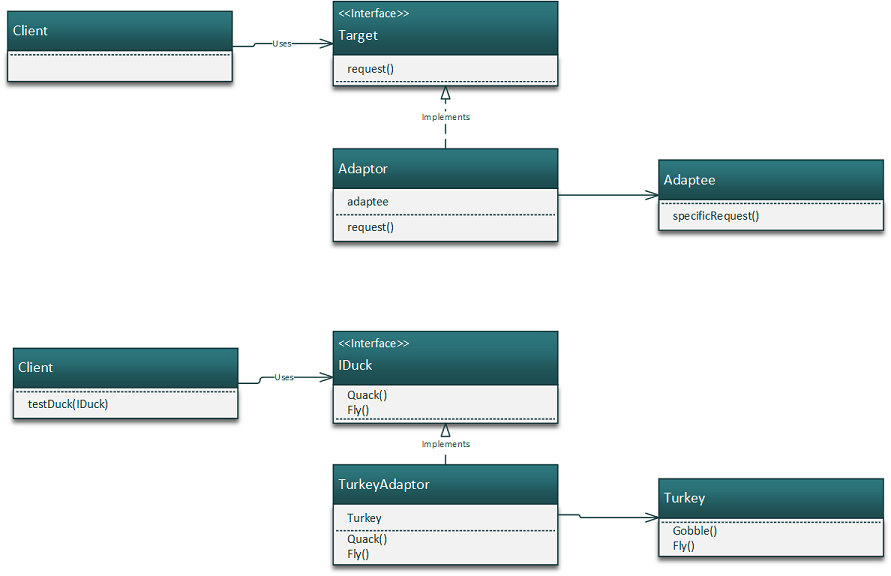

# Object Adaptor
The object adaptor pattern uses composition to achieve the
adaptor pattern

### Adaptor Pattern

The Adaptor Pattern converts the interface of a class into another 
interface the client expects. Adapter lets classes work together that 
couldn't otherwise because of incompatible interfaces. 

### Class Diagram

